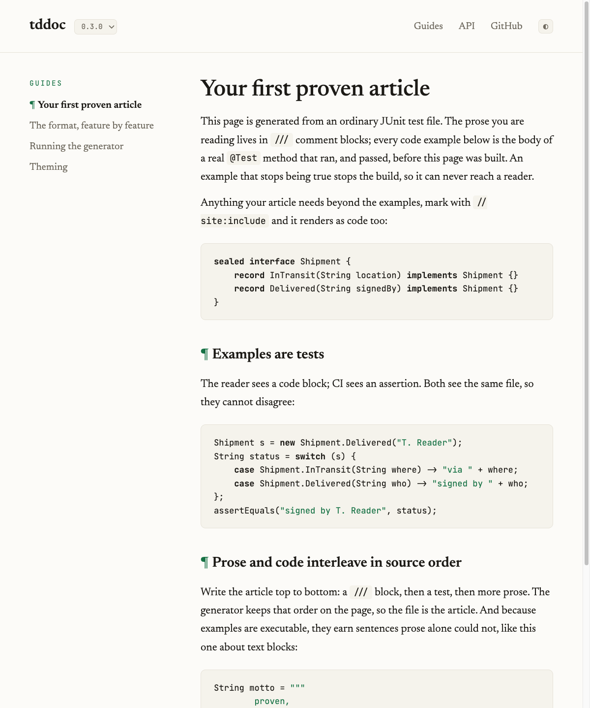

# tddoc

**Test-driven documentation: docs that are proven, not promised.**

tddoc turns executable tests into published articles. Prose and code live in
the same test file; every example on the resulting site is the body of a real
test that ran in CI. Examples cannot rot: if one breaks, the build breaks, and
the broken version never reaches your readers.

The name works like *doctest*: tddoc is the tool, and the articles you write
with it are tddocs.

This is more than API documentation. If you know the test-driven approach of
Spring REST Docs, this is that idea generalized beyond API reference: the
format is built for *articles* — guides, tutorials, release walkthroughs —
where the narrative interleaves with code that provably works, version by
version.

## Status

Early extraction. The generator was proven end to end as the documentation
engine of [fforj](https://github.com/fforj/fforj) (live at
[fforj.dev](https://fforj.dev)): doc-tests, versioned snapshots per release with
real behavioral diffs between them, and a GitHub Pages deploy where a failing
example can never ship. This repo is that engine becoming a general tool.

Current milestone: generalization is nearly complete — configuration lives in
a flat `tddoc.yml` (zero inline config for jbang, Gradle, and Maven), six
built-in themes ride on design tokens (a 15-line `--css` file rebrands the
site), articles get multi-language syntax highlighting, a dark/light toggle,
and `--watch` live preview. Next: the versioned-deploy workflow templates and
the fforj switchover that proves it all.

## What it looks like

This repo documents itself with its own format. The example below,
[`FirstArticleDocTest.java`](src/test/java/dev/tddoc/docs/FirstArticleDocTest.java),
is a real test file in this repo, run by `./gradlew test` like any other test.
It begins:

```java
/// ---
/// title: Your first proven article
/// slug: first-article
/// order: 1
/// summary: Prose in /// comments, examples as real tests. An example that breaks stops the build.
/// ---
///
/// This page is generated from an ordinary JUnit test file. The prose you are
/// reading lives in `///` comment blocks; every code example below is the body
/// of a real `@Test` method that ran, and passed, before this page was built.
/// ...
class FirstArticleDocTest {

    // site:include
    sealed interface Shipment {
        record InTransit(String location) implements Shipment {}
        record Delivered(String signedBy) implements Shipment {}
    }

    /// ## Examples are tests
    ///
    /// The reader sees a code block; CI sees an assertion. Both see the same
    /// file, so they cannot disagree:
    @Test
    void pattern_matching_reads_the_state() {
        Shipment s = new Shipment.Delivered("T. Reader");
        String status = switch (s) {
            case Shipment.InTransit(String where) -> "via " + where;
            case Shipment.Delivered(String who) -> "signed by " + who;
        };
        assertEquals("signed by T. Reader", status);
    }
    // ...
}
```

One command turns it into this page:

```bash
java src/main/java/dev/tddoc/SiteGen.java --docs src/test/java/dev/tddoc/docs
```



For a full production deployment — many guides, per-release frozen snapshots
with a live version selector, Javadoc folded in — see
[fforj.dev](https://fforj.dev), which this engine generates.

## The format

Articles are ordinary JUnit test files (doc-tests):

- Prose lives in `///` markdown comment blocks — plain line comments, so they
  compile on Java 21 and stay invisible to javadoc.
- Every example is the body of a real `@Test` method, run by your normal suite.
- A member preceded by `// site:include` is rendered as code too.
- The first `///` block carries front matter (`title`, `slug`, `order`,
  `summary`); a `[landing]` marker picks the homepage example.

The generator parses the doc-tests, interleaves prose and code in source order,
and renders a static site — markdown subset, small Java highlighter, javadoc
folded in under `/api/`, and per-release version snapshots with a live version
selector.

## Using it

Four tiers, in increasing order of commitment — pick yours:

<details open>
<summary><strong>jbang</strong> — try it, nothing to install</summary>

```bash
jbang tddoc@tddoc --docs src/test/java/your/pkg/docs --out build/site
```

Needs only [jbang](https://jbang.dev); resolves the latest release from Maven
Central.
</details>

<details>
<summary><strong>Gradle</strong> — plugin id <code>dev.tddoc</code></summary>

```kotlin
// settings.gradle.kts
pluginManagement { repositories { mavenCentral(); gradlePluginPortal() } }

// build.gradle.kts
plugins { id("dev.tddoc") version "<version>" }
tddoc {
    docs = file("src/test/java/your/pkg/docs")
    name = "yourproject"
}
```

`./gradlew tddocSite` runs your tests first, then generates `build/site`.
</details>

<details>
<summary><strong>Maven</strong> — goal <code>tddoc:site</code></summary>

```xml
<plugin>
  <groupId>dev.tddoc</groupId>
  <artifactId>tddoc-maven-plugin</artifactId>
  <version>${tddoc.version}</version>
  <configuration><docs>src/test/java/your/pkg/docs</docs></configuration>
</plugin>
```

Bound to `verify`, so the suite has passed before the site is built.
</details>

<details>
<summary><strong>Copy the file</strong> — own it forever</summary>

`SiteGen.java` is one file with zero dependencies. Copy it into your repo and
run it with the plain source launcher:

```bash
java SiteGen.java --docs src/test/java/your/pkg/docs --out build/site
```

This is a contract, not an accident: the artifact and the copied file must
always both work, and anything that breaks the copy-paste story is out of
scope.
</details>

## The bigger picture

tddoc is layer one of a three-layer idea:

1. **This tool** — doctest-first article tooling for the JVM.
2. **A protocol** — a language-agnostic format contract plus a provenance
   attestation (repo, commit, CI run, suite result), so "verified" is
   independently checkable by anyone.
3. **A front page** — an aggregator of living articles from repos that adopt
   the format, each with its verification badge and version selector.

Each layer is useful even if the next never happens.

## License

MIT
